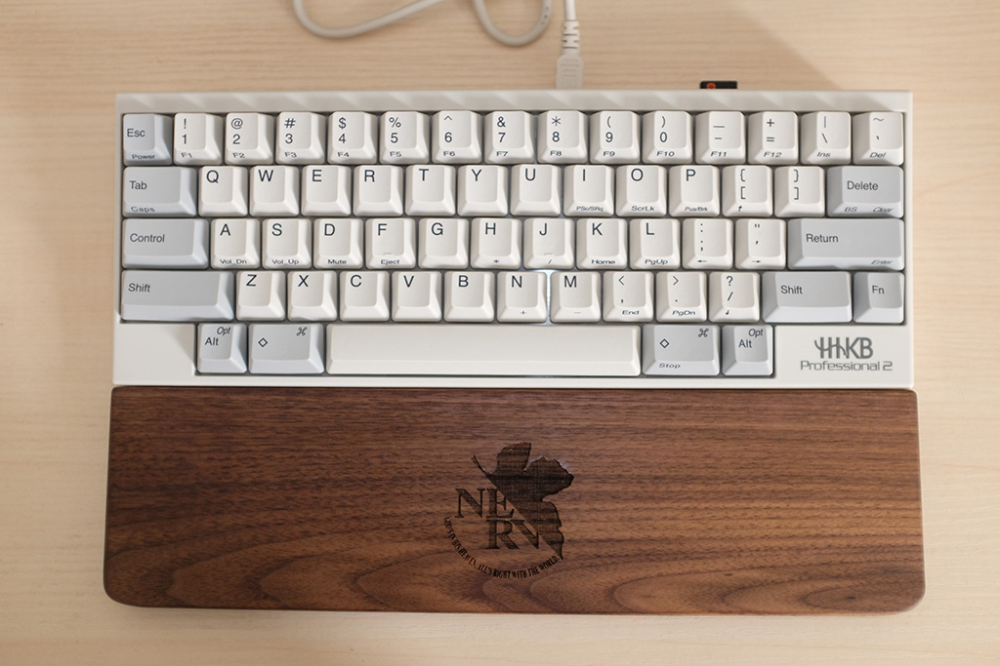

# hhkb_ydkb
> HHKB 键盘 + YDKB 主控 = 完美键盘

HHKB是一把极其独特的键盘。世界上再没有哪个键盘的设计者敢把左下角、右下角这么宝贵的地方给空出来。

独特的布局、独特的声音、独特的手感带来独一无二的使用体验，同时也让我吃了不少苦头。最头疼的就是 **方向键怎么办？** 曾经使用 [autohotkey](https://www.autohotkey.com/) 将 Ctrl+ikjl 映射成上下左右，Ctrl+h映射为Home，Ctrl+'映射为End，这样在撸代码的时候就可以双手不离开主键盘区实现常规的光标位移了。但是也有左手拿着咖啡杯，右手操作完鼠标，又想按方向键的时候。以及需要远程到其他电脑的时候。更别提这样正常的Ctrl+j、Ctrl+k等快捷键都不能用了。总之这个方案非常不完美。

还有一点不太爽的是一开始嫌弃蓝牙版的 HHKB 电池仓那里鼓起一块很丑，买了这个非蓝牙版的。虽然键盘线是可拆卸的，但每天都要插拔几次键盘线还是有点麻烦。有点羡慕蓝牙键盘的自由自在。

这两个问题最终都被 [YDKB 主控](http://ydkb.io/) 解决了。（想购买的同学可自行某宝搜索，我就不打广告了）

## 蓝牙

一开始购买这个主控主要是奔着它的蓝牙功能去的。实际的使用体验也非常好。不但没有难看的突起，还内置充电电池，超长待机（超过3周），可边充电边使用，开机秒连，打字也几乎感觉不到延迟。主控还自带3个不同颜色的可编程LED灯，配合键位映射非常实用。
缺点嘛也有几个：
1. 虽然默认的3级节电很给力，但在Word里会引发连击BUG。好在有解决方法：按左右Shift+P关闭节电就好了。
2. 不知道是不是个体差异，我的数字“2”有时候敲一次没反应，得敲好几下才行。
3. 全键无冲变成6键无冲了，不过我不打游戏没啥影响。
4. 蓝牙状态下键盘上的USB口不能用了。

但仍然算是接近完美的蓝牙解决方案。

## 键位映射

主控的官网上有很简单好用的键位映射编辑工具，编辑好之后也可以很简单地刷到主控里面，看官网中文文档就好，这里不细说了。

相较于 autohotkey，用主控改键有两大优点：
1. 键位是存在于键盘内的主控里的，不像 autohotkey 要依赖本机环境。远程到别人的电脑上键位依然不变。
2. 可以实现很多 autohotkey 实现不了的映射。例如可以设置单击 【右Shift】 是 【上方向键】，而按住 【右Shift】依然可以实现正常的Shift组合键。这样我就可以把右下角的4个键设置成独立的上下左右键了。终于可以喝着咖啡看谷歌，**单手操作方向键**啦。同样可以设置【按住空格键】加【ikjl】作为上下左右键，单击空格仍然是空格。不但使用上更顺手，Ctrl+j、Ctrl+k等组合键也不受影响了。

总之，YDKB主控提供了更多有意思的可能性，真乃迷你键盘的福音。

最后附上我的 [YDKB 配置文档](https://github.com/1-2-3/hhkb_ydkb/blob/master/HHKB_BLE.BIN)，有兴趣的同学可以把它导入 YKDB 官网上的键位设置小工具作为参考。

配列简要说明：
- 单击右Shift = ↑
- 右Alt = ↓
- 右◇ = ←
- Fn = →
- 按住Tab = Fn
- 左◇ = Win
- 按住空格 + i k j l h' = ↑ ↓ ← → Home End
- 按住空格 + 1~0 - + = F1~F12
- 按住Esc + 1~0 - + = F1~F12
- 按住\` + 1~0 - + = F1~F12
- Delete = Backspace
- 按住\` + Delete = Delete
- 按住\` + \ = Insert
- 按住\` + \[ = Win+Ctrl + ← （切换到前一个Win10虚拟桌面）
- 按住\` + \] = Win+Ctrl + → （切换到后一个Win10虚拟桌面）

有任何问题或创意欢迎在问题区留言哦。
